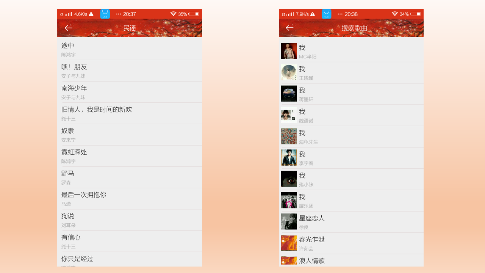
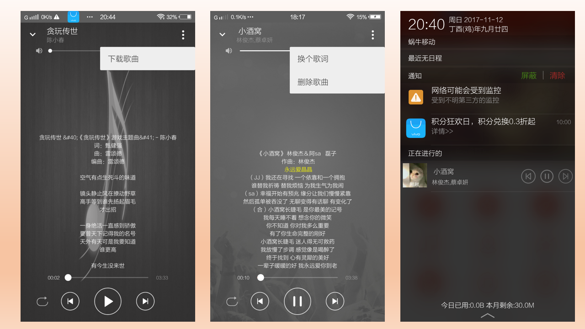
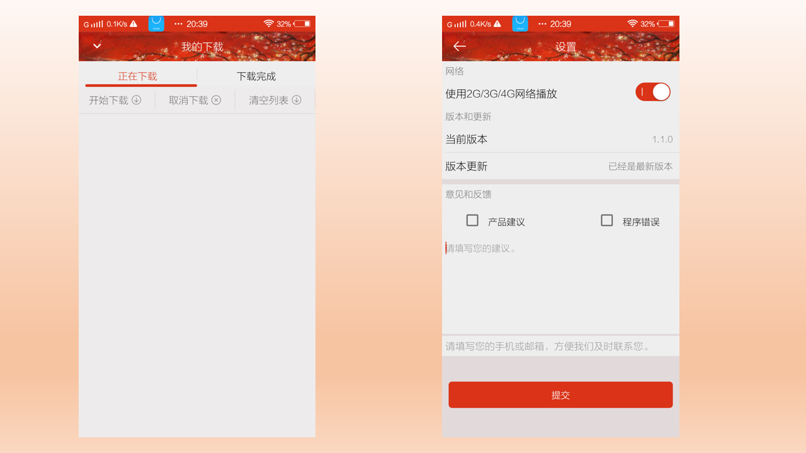

# Music
一款实现了主流的音乐APP大部分功能的音乐播放器。
## 功能：
>
> 1、扫描本地音乐，并且播放。
>
> 2、匹配本地音乐歌词，并将歌词文件存入数据库。
>
> 3、更换歌曲歌词。
>
> 4、删除歌曲。
>
> 5、通知栏显示当前播放歌曲，并可通过其进行切换歌曲。
>
> 6、获取网络热门榜单歌曲，并进行播放。
>
> 7、搜索网络歌曲。
>
> 8、更改歌曲歌词的大小已经拖动歌曲歌词进行播放。
>
> 9、判断网络状态，设置是否可在移动数据网络下播放。
>
> （下载功能因为歌曲下载链接没有权限，暂时无法实现）

## 界面截图：

